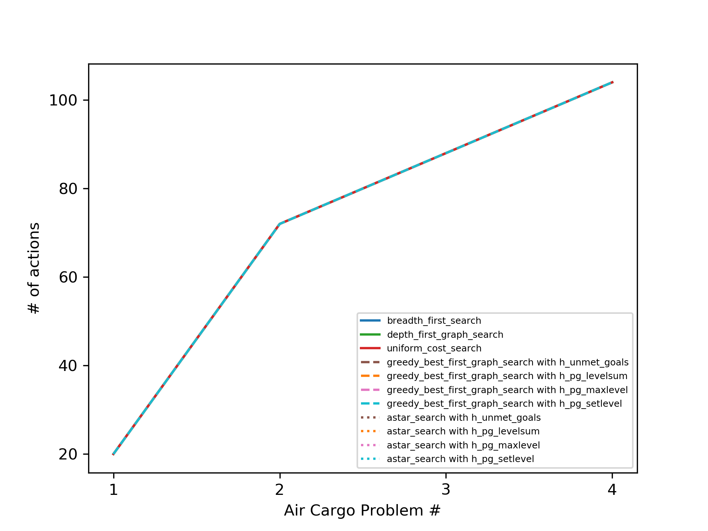
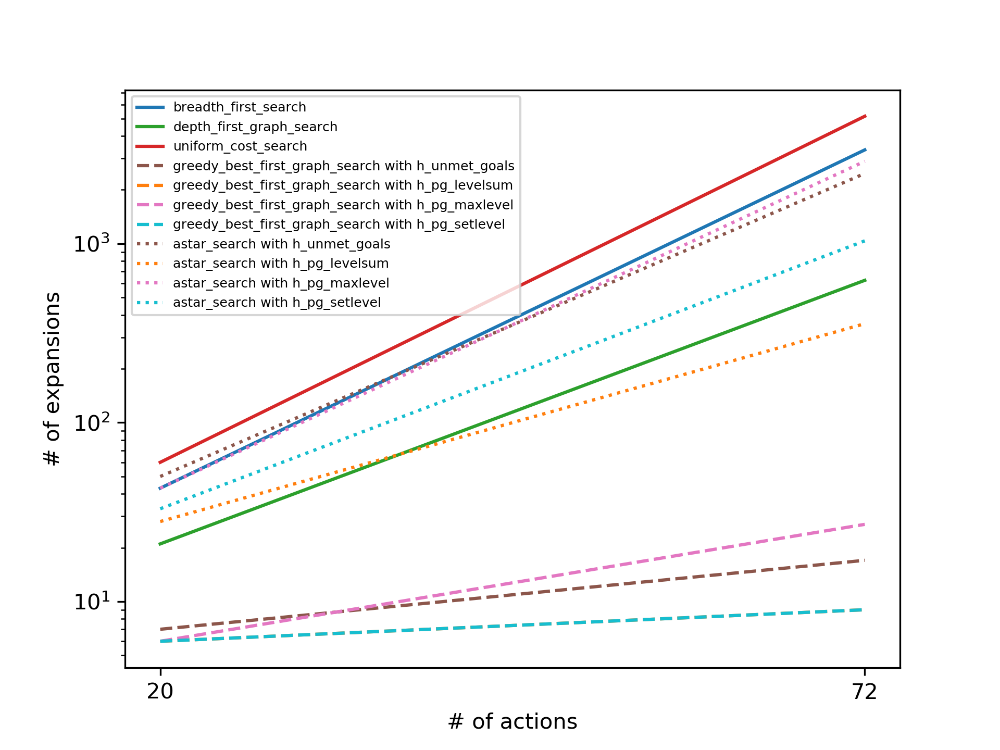
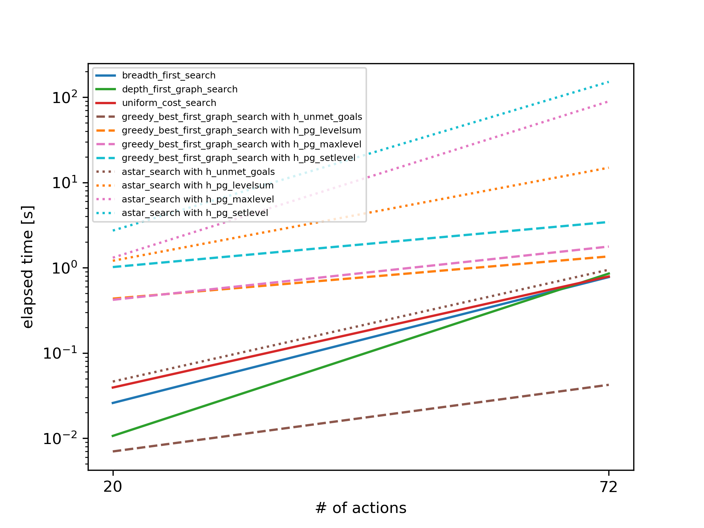
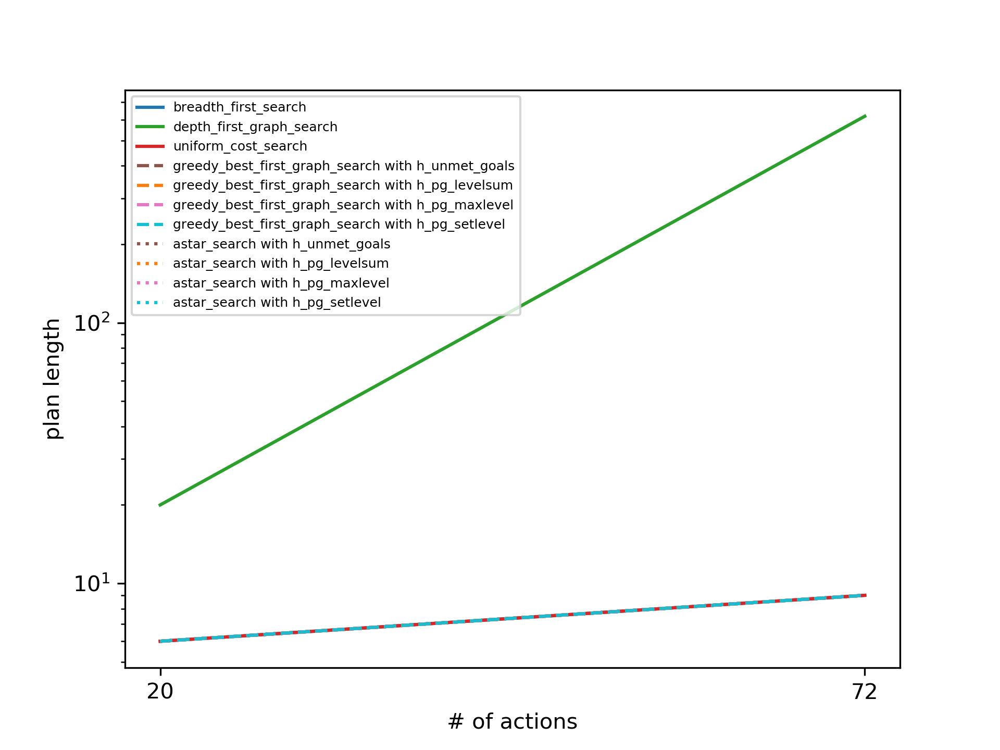
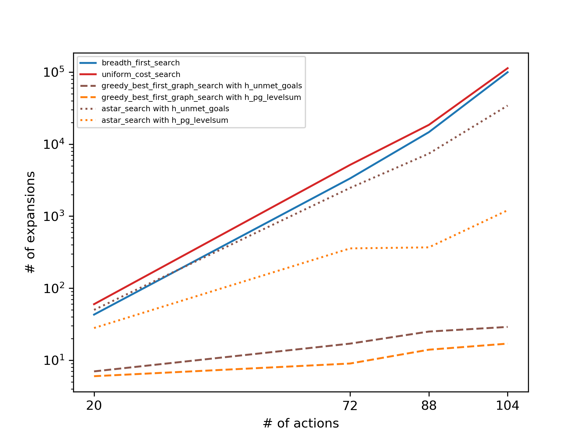
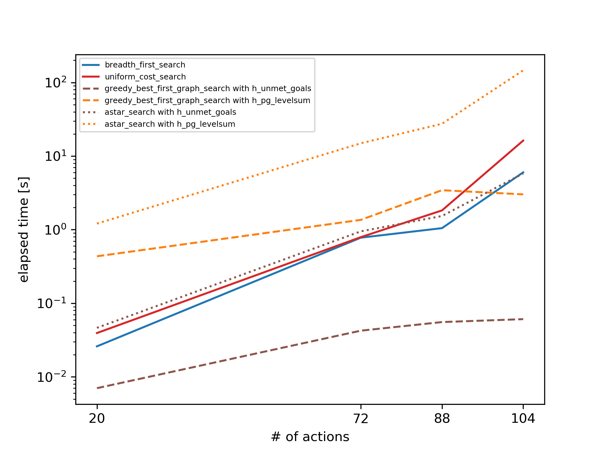
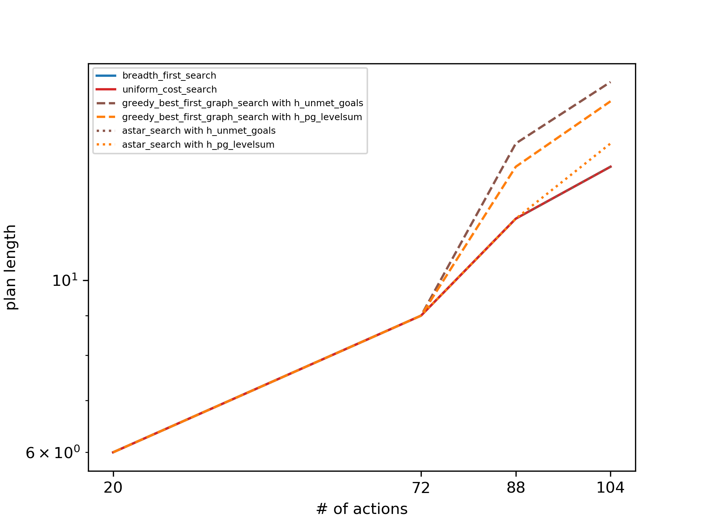

# **Project: Build a Forward-Planning Agent**
# Experimental Results & Report
## Number of Actions in the Domain
The search algorithms were tested using 4 different cargo problems with increasing complexity of the domains (numbers of airplanes, cargo items, and airports). The following figure depicts the number of actions in each problem.

## Air Cargo Problem #1 and #2
### Number of New Node Expansions

Comparing the individual search algortihms, the the number of nodes expanded is quite different as shown in the following graph. The breadth-first search needs the highest number of expansions to find the solution. Greedy best-first search algortihms require considerably fewer expansions. With increasing problem size the search algorithms need far more expansions. However, for greedy best-first search the growth is small.

Looking at the computation time the picture is different. Most of the A* search algorithms need a lot of time to compute the results. `greedy_best_first_graph_search` with `h_unmet_goals` is the fastes algorithm followed by the uninformed search algorithms and the `astar_search` with `h_unmet_goals`. The heuristics `h_pg_maxlevel` and `h_pg_setlevel` show the worst performance.

As expected, depth-first search has the longest plan. That is, it's solution is far from optimal. Therefore, it should not be used for problems 3 and 4.

Resulting from the figures above the following search algorithms should be used for the air cargo problems 3 and 4.

* uninformed search algorithms:

  * `breadth_first_search`

  * `uniform_cost_search`

* informed search algorithms:

  * greedy best-first search:

    * `h_unmet_goals`

    * `h_pg_levelsum`

  * A* search:

    * `h_unmet_goals`

    * `h_pg_levelsum`

## Air Cargo Problem #1 to #4

Problems 3 and 4 show similar results as the first two problems did. The uniformed search algorithms and A* search with the unmet-goals heuristic need the most node expansions. The lowest number of expansions is necesary for the greedy best-first search algorithms. The number of expansions grows exponentially with increasing problem size, as the curves form nearly straight lines in the logarithmic diagram.

Regarding computation time, `greedy_best_first_graph_search` with `h_unmet_goals` performes best. A* search with the sum of the level costs of the planning graph as heuristic is the slowest of the selected algorithms. Apart from the greedy best-first search algorithm with the unmet-goals heuristic, computation time grows exponentially with increasing problem complexity.

Even though, `greedy_best_first_graph_search` with `h_unmet_goals` is the fastes algortithm it has the largest plan length.

## Questions

1. *Which algorithm or algorithms would be most appropriate for planning in a very restricted domain (i.e., one that has only a few actions) and needs to operate in real time?*

   In a very restricted domain, `greedy_best_first_graph_search` with `h_unmet_goals` is the best choice.

2. *Which algorithm or algorithms would be most appropriate for planning in very large domains (e.g., planning delivery routes for all UPS drivers in the U.S. on a given day)*

   For this problem greedy best-first search is the best algorithm too.

3. *Which algorithm or algorithms would be most appropriate for planning problems where it is important to find only optimal plans?*

   To find the optimal plans, the uniformed algorithms breadth-first search and uniform cost search as well as A* serach with an admissible heuristic (in this case unmet goals) would be most appropriate.
